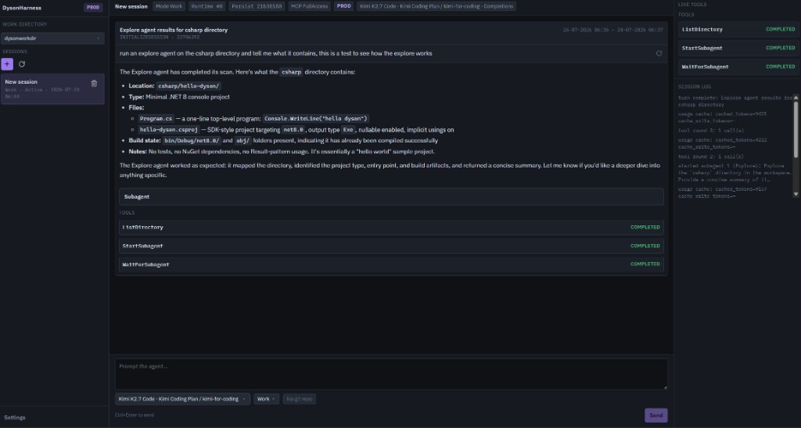

# DysonHarness

AI coding-agent harness from [EntitySystems](https://github.com/EntitySystems): a desktop/web agent shell and .NET engine with OpenAI-compatible providers, work-directory sessions, MCP-shaped tools, and orchestrator subagents.



## What it does

- Work / Explore / Drone (and other) agent modes
- Subagent spawn/report (`StartSubagent`, `SubmitSubagentReport`) with UI cards and parent navigation
- Workspace file tools, shell, and in-process web search/fetch
- SQLite session persistence and resume
- Demo and OpenAI-compatible model providers

## Quick start

Requires .NET 10 (`net10.0`). From the repo root:

```bash
dotnet run --project src/Harness/Harness.UI --urls http://localhost:5180
```

Open the agent shell at http://localhost:5180. Configure providers under **Settings → Models**.

Contributor and agent notes: [AGENTS.md](AGENTS.md).

## Planned

- **Coding agent CLI** — a terminal client that drives the same engine (sessions, tools, subagents) without the graphical shell, for scripting, CI, and headless workflows.

## Documentation

- [Engine](docs/engine/README.md) — session loop, modes, MCP, tools, completion, optimizer
- [Engine API surface](docs/engine/api-surface.md) — public bindable types
- [Model profiles & app data](docs/storage/models.md) — app mode, SQLite paths, ephemeral providers
- [Sessions & resume](docs/storage/sessions.md) — turns, session log, `GetFullSession`
- [Work directories](docs/storage/work-directories.md) — registered workspace roots
- [UI](docs/ui/README.md) — agent shell (`Harness.UI`)
- [WebView2 packaging](docs/packaging/webview.md) — future Windows host

## Rules

- [C#](rules/rules_csharp.md) · [Skills](rules/rules_skills.md) · [Docs](rules/rules_docs.md)

## License

Copyright (C) 2026 EntitySystems. Licensed under [AGPL-3.0](LICENSE).
