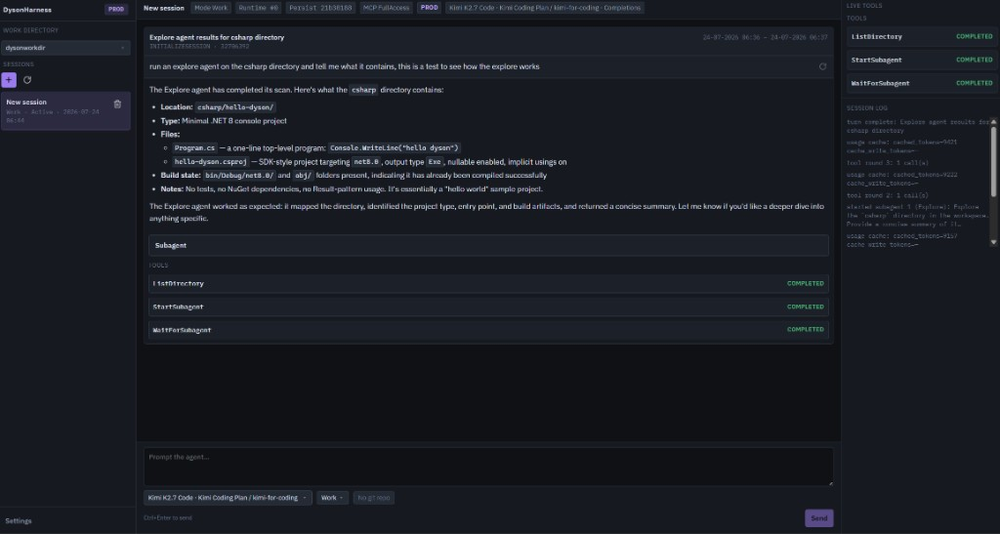

# DysonHarness

**DysonHarness** is a multitasking orchestrator of smaller agents for large-scale work — not a single-agent chat wrapper. From [EntitySystems](https://github.com/EntitySystems).

> **Early development.** This project is still in early production / active development and is **not even in beta**. Expect change, rough edges, and incomplete surfaces.



## What it does

- Modes for orchestrating, planning, exploring, and delegated implementation
- Spawns focused subagents that report back into the parent session
- Workspace editing, shell, and web research; browser control on Windows
- Plan → review → build flow for larger changes
- Per-mode tool limits in Settings (see Usage guidance)
- Drop noisy turns from model context when conversations get heavy
- Sessions persist and resume; works with OpenAI-compatible providers

## Notable mentions

- **JDSL** (`JsonDynamicStructuredLanguageToolchain`) — one MCP tool that runs nested JSON programs (`Entry` / `FunctionCall` / `OnSuccess` / `OnFailure` / `ContinueWith` / `Loop`) against existing session catalog tools, with `IsError` branching, `fromArg`/`fromResult` refs, and safety caps (nesting depth, max nested invocations, loop `MaxIterations`). The UI flow modal shows executed (green) vs ignored (grey) paths. Spec: [json-dynamic-toolchain](docs/engine/json-dynamic-toolchain.md) · Agent guide: [JDSL.md](src/Harness/Harness.Engine/Resources/Skills/JDSL.md)

## Tested models

- GLM 5.2
- GLM 4.7
- Kimi K2.7 Code
- Kimi K3

## Usage guidance

Built for **capable** models. Multi-agent state can overwhelm smaller self-hosted models (for example Gemma 4 32B or Qwen 3.6 27B). Limiting tools per mode helps a little, but it is only a **stopgap**.

Practical defaults: use Work to orchestrate, Explore to research, and Drone to implement. Configure models under **Settings**.

## Quick start

Requires .NET 10 (`net10.0`). From the repo root:

```bash
dotnet run --project src/Harness/Harness.UI --urls http://localhost:5180
```

Open the agent shell at http://localhost:5180. Configure providers under **Settings → Models**.

Contributor and agent notes: [AGENTS.md](AGENTS.md).

## Planned

- **Coding agent CLI** — a terminal client that drives the same engine without the graphical shell, for scripting, CI, and headless workflows (optional one-line desktop shell later).

## Documentation

- [Engine](docs/engine/README.md) — session loop, modes, tools, completion, optimizer
- [Engine API surface](docs/engine/api-surface.md) — public bindable types
- [Model profiles & app data](docs/storage/models.md) — app mode, providers, persistence
- [Sessions & resume](docs/storage/sessions.md) — turns, session log, resume
- [Work directories](docs/storage/work-directories.md) — registered workspace roots
- [UI](docs/ui/README.md) — agent shell
- [Windows packaging](docs/packaging/webview.md) — desktop / browser packaging

## Rules

See [AGENTS.md](AGENTS.md) for contributor and agent rules. Short index: [C#](rules/rules_csharp.md) · [Skills](rules/rules_skills.md) · [Docs](rules/rules_docs.md).

## License

Copyright (C) 2026 EntitySystems. Licensed under [AGPL-3.0](LICENSE).
