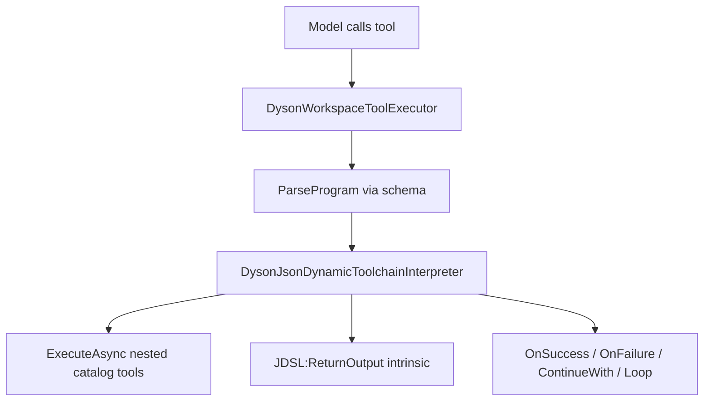

# JsonDynamicStructuredLanguageToolchain

Session MCP tool that interprets a strict nested JSON program (`Entry` / `FunctionCall` / `Loop`) and dispatches nested calls only to **existing catalog tools**. Branching uses nested `DysonToolCallResult.IsError` only.

**Source of truth:** C# schema types in [`DysonJsonDynamicToolchainSchema.cs`](../../src/Harness/Harness.Engine/Mcp/DysonJsonDynamicToolchainSchema.cs). Agent-facing guide: [`Resources/Skills/JDSL.md`](../../src/Harness/Harness.Engine/Resources/Skills/JDSL.md) — load with `LoadSkill(name: "JDSL", loadIndexOnly: true)` or composer `/skill-jdsl`.

## Catalog

| Field | Value |
| ----- | ----- |
| Name | `JsonDynamicStructuredLanguageToolchain` |
| Input | `{ "program": object \| string }` (+ harness `stage`) |
| Executor | `DysonWorkspaceToolExecutor` → `DysonJsonDynamicToolchainInterpreter` |
| Result | `DysonJsonDynamicToolchainResult` JSON (`status`, `flow`, `steps`, `finalContent`, `returned`, `error`) |

## Program schema (strict)

PascalCase wire. Flat `"FunctionCall": "MCP:…"` is a **parse error**.

- `Entry.Arguments` — optional **object** of named locals (arrays rejected)
- `Entry.Actions` — ActionNode: exactly one of nested `FunctionCall` **object** or `Loop` **object**
- `FunctionCall.Function` — `"MCP:ToolName"`, `"ToolName"`, or the JDSL intrinsic `"JDSL:ReturnOutput"` (required)
- `FunctionCall.Arguments` — named object only; values may be literals or ref strings
- `OnSuccess` / `OnFailure` / `ContinueWith` — optional ActionNodes
- `Loop.Condition` / `Loop.Action` — required ActionNodes
- `Loop.MaxIterations` — optional int; default **5**; runtime clamp **1–20**; typo `MaxInterations` rejected

### JDSL intrinsic: `JDSL:ReturnOutput`

Not an MCP catalog tool. Only recognized when `Function` is exactly `JDSL:ReturnOutput` (`MCP:ReturnOutput` / bare `ReturnOutput` fail as unknown/not in catalog).

- Required argument: `output` (literal or `fromArg:` / `fromResult:` ref). Non-string JSON values are serialized to text.
- On success: sets `finalContent` to that value, sets `returned: true`, marks the flow node executed, **skips** `OnSuccess` / `OnFailure` / `ContinueWith` (built as skipped), and **stops** the program (ancestor `ContinueWith` and further loop iterations do not run).
- Does **not** count against the nested MCP invocation cap (no `ExecuteAsync` dispatch).
- Missing/unresolved `output` → this step is `IsError` (same branching as other FunctionCalls via `OnFailure`).

### Refs

| Ref | Meaning |
|-----|---------|
| `fromArg:<name>` | `Entry.Arguments[<name>]` |
| `fromResult:$0` | `Content` of the FunctionCall that just completed |
| `fromResult:<jsonPath>` | JSON path into that Content (`a.b.0`) |

### Caps

- Max action nesting depth **8**
- Max nested invocations **50** (ReturnOutput does not increment)
- No self-call of this tool
- Nested `Stage` inherits outer call; `CallId` = `{parent}/n{i}`
- Nested `EndsCurrentTurn` stops after that node’s success/failure path (skips `ContinueWith`) and surfaces on the outer result

## Evaluation

- **FunctionCall:** resolve args → dispatch → `IsError` ? `OnFailure` : `OnSuccess` → then `ContinueWith` (unless `EndsCurrentTurn` or prior `ReturnOutput`)
- **`JDSL:ReturnOutput`:** resolve `output` → on success set return + stop; on arg error use normal `OnFailure` path
- **Loop:** while Condition is `!IsError` and under `MaxIterations`, run Action; Condition `IsError` exits normally; `ReturnOutput` stops the loop
- **Outer IsError:** parse/cap/unknown-tool/self-call, or unhandled leaf error (no successful `OnFailure` path)

## Flow result (UI)

`flow` mirrors the program tree. Taken nodes have `executed: true`; sibling untaken branches remain with `executed: false` for the flow modal (green vs grey borders). See [UI README](../ui/README.md) tool variants.

Persisted/UI `Content` is always the full envelope. When `returned` is true, the **model transcript** (`OpenAiCacheFriendlyTranscriptBuilder.FormatToolResultContent`) emits only `finalContent` (or `[error] …` on error) instead of the envelope.

## Tests

`DysonJsonDynamicToolchainTests` in `Harness.Tests` — schema reject-flat, flow executed flags, branches, loops, refs, caps, ReturnOutput success/stop/reject/arg-error + transcript slim.
